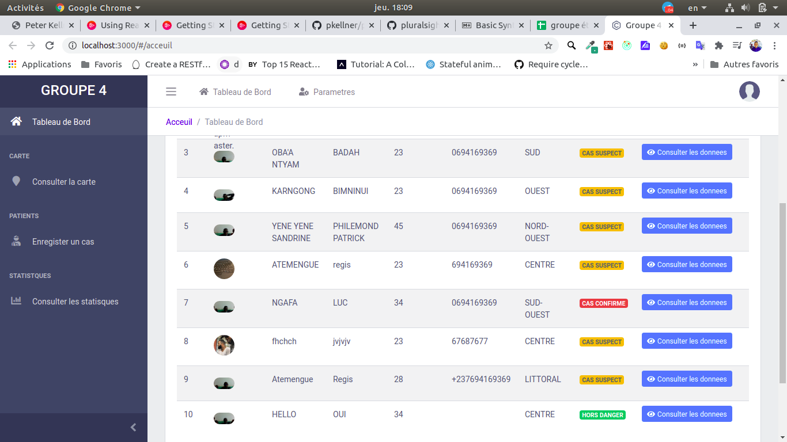
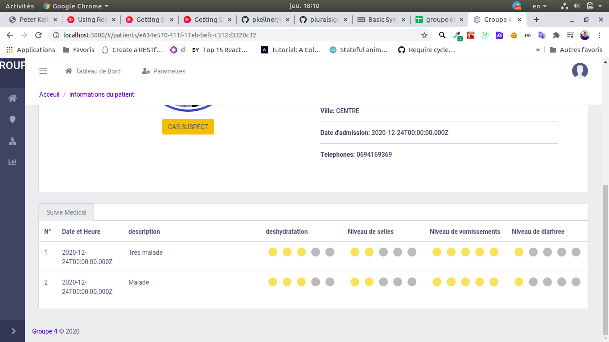

<!-- @format -->

# GROUPE 7 INFO 4077

## Membres du Groupe

1. ATEMENGUE MOAFEMBE REGIS
2. LOL ABAKAR ADAM
3. KUIMO KAMGO CHRISTIAN BROWNDON
4. MPOUDI EYAMBE ANDRÉ JEROME MARCEL
5. SIMEU YAN

## Description du repository

Le repertoire contient les code source des applications mobile et produit par le groupe 4. Le but etant de faire des applications web mobile
dans le domaine medical, principale sur le suivie des maladies (contexte epidemioligique), l'equipe sait dans le sur cas du cholera qui
est une maladie a forte concentration.

## QUELQUES IMAGES

#### se connecter

#### ajouter un patient

#### listes des patients

#### suivie du patients

#### les statistiques

## LES TECHNOLOGIES

- Front-End: React
- Backend: NodeJS + Python Django
- Base de donnees: PostgreSQL
- Mobile App: React Native + Flutter
- Mobile DevOps: Jenkins + Nodejs + Appuim

## INSTALLATION DE L'APPLICATION

### APPLICATION WEB

1. **Install [Node 12.14.0 with NPM 6.14.4](https://nodejs.org)**.
2. **Cloner ce repository.** - `git clone https://github.com/jiofidelus/Groupe4_INF4077.git`
3. **Installer la base de donnees.**

- Utiliser le fichier CHOLERA_EPIDEMIE restaurer la base de donnees ### POSTGRES

4. **Creer un fichier .env (Fichier de configuration de l'application) dans le repertoire et saisir les parametres de connexion a votre base donnees veuillez completer l'utilisateur de la base de donness et le password** ####back_with_node

5. \*\*Installer les fichiers node_modules de l'application Front et Backend: web_app et backend_with_node (example: cd backend_with_node - `cd backend_with_node`
6. **Install Node Packages with Dependencies.** - `npm install`

Demarrer les deux applications

##### Front-end

`cd web_app`

`npm start`

##### Backend-end

`cd backend_with_node`

`npm start`

### MOBILE APP: GOOGLE DRIVE LINK

https://drive.google.com/drive/folders/1Ye1VNp_l6vP9luDWcOHdyd6ONfjNeK6D?usp=sharing
